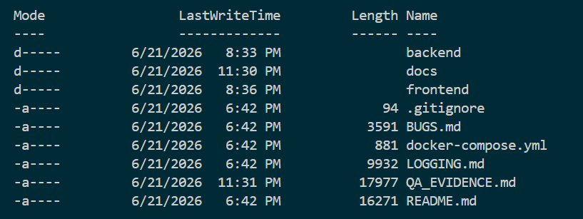
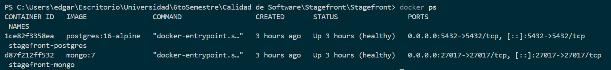
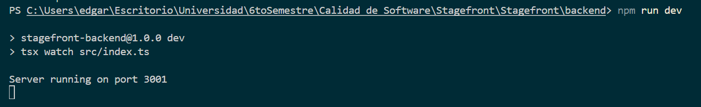
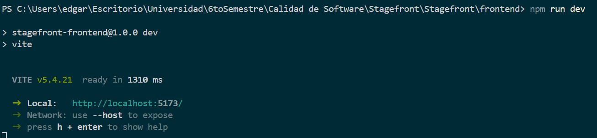

# QA Evidence - Stagefront

## Información general

| Campo                    | Valor                            |
| ------------------------ | -------------------------------- |
| Proyecto                 | Stagefront                       |
| Responsables             | Edgar Castro y Javier Marin      |
| Entorno                  | Local                            |
| Sistema operativo        | Windows                          |
| Frontend                 | http://localhost:5173            |
| Backend                  | http://localhost:3001            |
| Base de datos relacional | PostgreSQL                       |
| Base de datos NoSQL      | MongoDB                          |
| Periodo de ejecución     | Semana de ejecución del proyecto |

---

## Objetivo

Este documento concentra las evidencias de ejecución del proceso de calidad aplicado al proyecto Stagefront. Incluye capturas de entorno, ejecución de servicios, pruebas manuales, pruebas automatizadas, revisión de seguridad, rendimiento, accesibilidad y compatibilidad.

---

# 1. Evidencia de entorno

## EV-001 - Estructura del proyecto

| Campo              | Detalle                                                                                                                                    |
| ------------------ | ------------------------------------------------------------------------------------------------------------------------------------------ |
| Descripción        | Evidencia de la estructura principal del repositorio Stagefront.                                                                           |
| Comando            | `dir`                                                                                                                                      |
| Resultado esperado | Deben visualizarse las carpetas `backend`, `frontend`, `docs` y archivos como `README.md`, `docker-compose.yml`, `BUGS.md` y `LOGGING.md`. |
| Estado             | Pending                                                                                                                                    |
| Evidencia          | `docs/evidence/01-project-structure.png`                                                                                                   |

---

## EV-002 - Contenedores Docker activos

| Campo              | Detalle                                                         |
| ------------------ | --------------------------------------------------------------- |
| Descripción        | Evidencia de PostgreSQL y MongoDB ejecutándose mediante Docker. |
| Comando            | `docker ps`                                                     |
| Resultado esperado | Deben aparecer contenedores activos para PostgreSQL y MongoDB.  |
| Estado             | Pending                                                         |
| Evidencia          | `docs/evidence/02-docker-running.png`                           |

---

## EV-003 - Backend ejecutándose

| Campo              | Detalle                                                           |
| ------------------ | ----------------------------------------------------------------- |
| Descripción        | Evidencia del backend ejecutándose en modo desarrollo.            |
| Comando            | `cd backend` y `npm run dev`                                      |
| Resultado esperado | El backend debe iniciar correctamente en `http://localhost:3001`. |
| Estado             | Pending                                                           |
| Evidencia          | `docs/evidence/03-backend-running.png`                            |

---

## EV-004 - Frontend ejecutándose

| Campo              | Detalle                                                            |
| ------------------ | ------------------------------------------------------------------ |
| Descripción        | Evidencia del frontend ejecutándose con Vite.                      |
| Comando            | `cd frontend` y `npm run dev`                                      |
| Resultado esperado | El frontend debe iniciar correctamente en `http://localhost:5173`. |
| Estado             | Pending                                                            |
| Evidencia          | `docs/evidence/04-frontend-running.png`                            |

---

# 2. Evidencia funcional

## EV-005 - Home del sistema

| Campo              | Detalle                                                |
| ------------------ | ------------------------------------------------------ |
| Descripción        | Evidencia visual de la página principal de Stagefront. |
| URL                | http://localhost:5173                                  |
| Resultado esperado | La página principal debe cargar correctamente.         |
| Estado             | Pending                                                |
| Evidencia          | `docs/evidence/05-home-page.png`                       |

---

## EV-006 - Catálogo de eventos

| Campo              | Detalle                                           |
| ------------------ | ------------------------------------------------- |
| Descripción        | Evidencia visual del catálogo/listado de eventos. |
| URL                | http://localhost:5173/events                      |
| Resultado esperado | Deben mostrarse eventos disponibles.              |
| Estado             | Pending                                           |
| Evidencia          | `docs/evidence/06-events-page.png`                |

---

## EV-007 - Endpoint de eventos

| Campo              | Detalle                                         |
| ------------------ | ----------------------------------------------- |
| Descripción        | Evidencia de respuesta del endpoint de eventos. |
| URL                | http://localhost:3001/api/v1/events             |
| Resultado esperado | La API debe responder con JSON y código 200.    |
| Estado             | Pending                                         |
| Evidencia          | `docs/evidence/07-api-events.png`               |

---

## EV-008 - Endpoint de estadísticas

| Campo              | Detalle                                                          |
| ------------------ | ---------------------------------------------------------------- |
| Descripción        | Evidencia de respuesta del endpoint de estadísticas.             |
| URL                | http://localhost:3001/api/v1/stats                               |
| Resultado esperado | La API debe responder correctamente con información estadística. |
| Estado             | Pending                                                          |
| Evidencia          | `docs/evidence/08-api-stats.png`                                 |

---

# 3. Evidencia de defectos

## EV-009 - Defecto de validación en checkout

| Campo              | Detalle                                              |
| ------------------ | ---------------------------------------------------- |
| Descripción        | Evidencia relacionada con validaciones de checkout.  |
| Bug relacionado    | BUG-002, BUG-004 o BUG-005                           |
| Resultado esperado | El sistema debe rechazar datos inválidos de tarjeta. |
| Estado             | Pending                                              |
| Evidencia          | `docs/evidence/09-checkout-validation-bug.png`       |

---

## EV-010 - Defecto de campos con espacios

| Campo              | Detalle                                                                                  |
| ------------------ | ---------------------------------------------------------------------------------------- |
| Descripción        | Evidencia de formulario aceptando o evaluando campos compuestos únicamente por espacios. |
| Bug relacionado    | BUG-003                                                                                  |
| Resultado esperado | El sistema debe rechazar campos vacíos después de aplicar trim.                          |
| Estado             | Pending                                                                                  |
| Evidencia          | `docs/evidence/10-blank-spaces-bug.png`                                                  |

---

# 4. Evidencia de seguridad

## EV-011 - npm audit backend

| Campo              | Detalle                                                                             |
| ------------------ | ----------------------------------------------------------------------------------- |
| Descripción        | Evidencia de revisión de vulnerabilidades en dependencias del backend.              |
| Comando            | `cd backend` y `npm audit`                                                          |
| Resultado esperado | Se documentan vulnerabilidades encontradas o ausencia de vulnerabilidades críticas. |
| Estado             | Pending                                                                             |
| Evidencia          | `docs/evidence/11-npm-audit-backend.png`                                            |

---

## EV-012 - npm audit frontend

| Campo              | Detalle                                                                             |
| ------------------ | ----------------------------------------------------------------------------------- |
| Descripción        | Evidencia de revisión de vulnerabilidades en dependencias del frontend.             |
| Comando            | `cd frontend` y `npm audit`                                                         |
| Resultado esperado | Se documentan vulnerabilidades encontradas o ausencia de vulnerabilidades críticas. |
| Estado             | Pending                                                                             |
| Evidencia          | `docs/evidence/12-npm-audit-frontend.png`                                           |

---

# 5. Evidencia de accesibilidad y compatibilidad

## EV-013 - Vista responsive móvil

| Campo              | Detalle                                                                   |
| ------------------ | ------------------------------------------------------------------------- |
| Descripción        | Evidencia del sistema en viewport móvil 390x844.                          |
| Herramienta        | Chrome DevTools                                                           |
| Resultado esperado | No debe existir desbordamiento horizontal y el contenido debe ser usable. |
| Estado             | Pending                                                                   |
| Evidencia          | `docs/evidence/13-mobile-responsive.png`                                  |

---

## EV-014 - Vista responsive tablet

| Campo              | Detalle                                            |
| ------------------ | -------------------------------------------------- |
| Descripción        | Evidencia del sistema en viewport tablet 768x1024. |
| Herramienta        | Chrome DevTools                                    |
| Resultado esperado | El layout debe adaptarse correctamente a tablet.   |
| Estado             | Pending                                            |
| Evidencia          | `docs/evidence/14-tablet-responsive.png`           |

---

## EV-015 - Navegación con foco visible

| Campo              | Detalle                                                  |
| ------------------ | -------------------------------------------------------- |
| Descripción        | Evidencia de navegación con teclado y foco visible.      |
| Método             | Presionar Tab varias veces en la interfaz.               |
| Resultado esperado | El elemento enfocado debe ser identificable visualmente. |
| Estado             | Pending                                                  |
| Evidencia          | `docs/evidence/15-keyboard-focus.png`                    |

---

# 6. Evidencia de rendimiento

## EV-016 - k6 instalado

| Campo              | Detalle                                              |
| ------------------ | ---------------------------------------------------- |
| Descripción        | Evidencia de instalación de k6.                      |
| Comando            | `k6 version`                                         |
| Resultado esperado | La terminal debe mostrar la versión instalada de k6. |
| Estado             | Pending                                              |
| Evidencia          | `docs/evidence/16-k6-version.png`                    |

---

## EV-017 - Load test con k6

| Campo              | Detalle                                                                       |
| ------------------ | ----------------------------------------------------------------------------- |
| Descripción        | Evidencia de ejecución de prueba de carga.                                    |
| Comando            | `k6 run performance\k6-load-test.js`                                          |
| Resultado esperado | El reporte debe mostrar métricas de duración, checks y porcentaje de errores. |
| Estado             | Pending                                                                       |
| Evidencia          | `docs/evidence/17-k6-load-test.png`                                           |

---

# 7. Evidencia de pruebas automatizadas

## EV-018 - Pruebas unitarias backend

| Campo              | Detalle                                                                |
| ------------------ | ---------------------------------------------------------------------- |
| Descripción        | Evidencia de ejecución de pruebas unitarias.                           |
| Comando            | `cd backend` y `npm run test`                                          |
| Resultado esperado | Las pruebas unitarias deben ejecutarse y mostrar resultado en consola. |
| Estado             | Pending                                                                |
| Evidencia          | `docs/evidence/18-unit-tests.png`                                      |

---

## EV-019 - Pruebas de integración backend

| Campo              | Detalle                                                    |
| ------------------ | ---------------------------------------------------------- |
| Descripción        | Evidencia de ejecución de pruebas de integración.          |
| Comando            | `cd backend` y `npm run test`                              |
| Resultado esperado | Las pruebas de integración deben ejecutarse con Supertest. |
| Estado             | Pending                                                    |
| Evidencia          | `docs/evidence/19-integration-tests.png`                   |

---

## EV-020 - Pruebas E2E Cypress

| Campo              | Detalle                                            |
| ------------------ | -------------------------------------------------- |
| Descripción        | Evidencia de ejecución de pruebas end-to-end.      |
| Comando            | `cd frontend` y `npm run cy:run`                   |
| Resultado esperado | Cypress debe ejecutar los flujos E2E configurados. |
| Estado             | Pending                                            |
| Evidencia          | `docs/evidence/20-cypress-tests.png`               |

---

# 8. Resumen de evidencias

| ID | Evidencia | Estado |
|---|---|
| EV-001 | Estructura del proyecto | Pass |
| EV-002 | Docker activo | Pass |
| EV-003 | Backend ejecutándose | Pass |
| EV-004 | Frontend ejecutándose | Pass |
| EV-005 | Home del sistema | Pass |
| EV-006 | Catálogo de eventos | Pass |
| EV-007 | Endpoint de eventos | Pending |
| EV-008 | Endpoint de estadísticas | Pending |
| EV-009 | Bug checkout | Pending |
| EV-010 | Bug campos con espacios | Pending |
| EV-011 | npm audit backend | Pending |
| EV-012 | npm audit frontend | Pending |
| EV-013 | Responsive móvil | Pending |
| EV-014 | Responsive tablet | Pending |
| EV-015 | Foco visible | Pending |
| EV-016 | k6 instalado | Pending |
| EV-017 | Load test k6 | Pending |
| EV-018 | Unit tests | Pending |
| EV-019 | Integration tests | Pending |
| EV-020 | Cypress tests | Pending |

---

# 9. Observaciones finales

Las evidencias se irán actualizando conforme se ejecuten las pruebas manuales y automatizadas. Cada captura debe guardarse dentro de la carpeta `docs/evidence/` y referenciarse en este documento con el nombre correspondiente.

En caso de que alguna prueba no pueda ejecutarse por limitaciones de entorno, debe documentarse como `Blocked` o `Not Executed`, explicando brevemente la razón.
